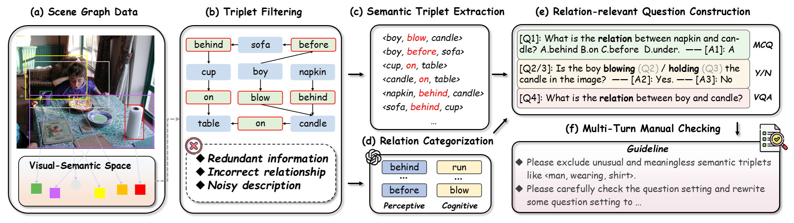
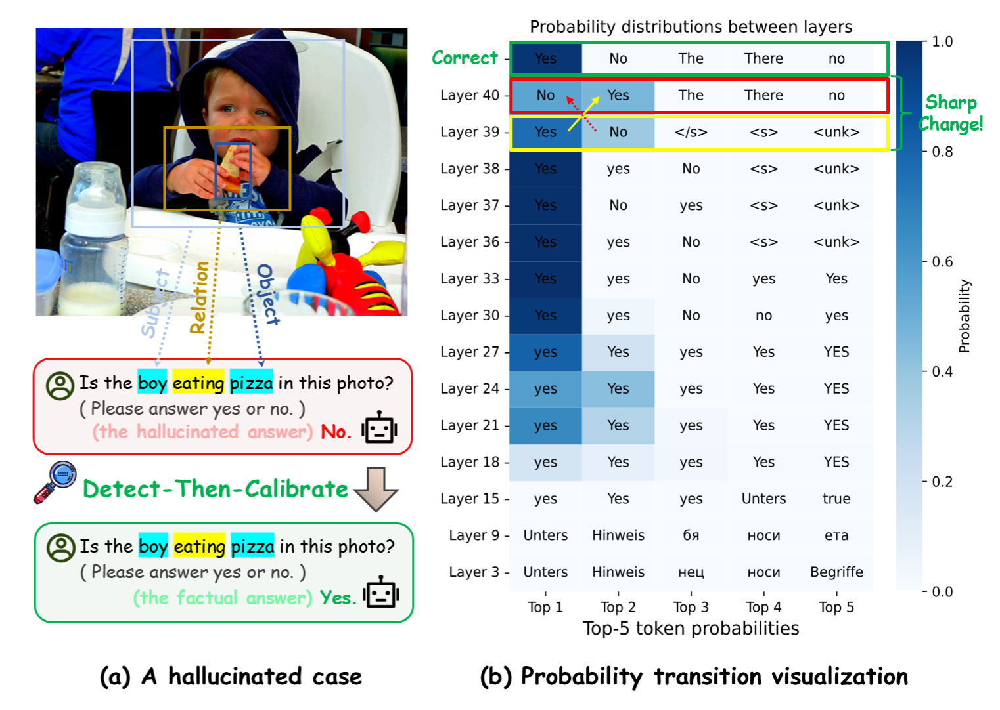

# Reefknot: A Comprehensive Benchmark for Relation Hallucination Evaluation, Analysis and Mitigation in Multimodal Large Language Models

This repository contains the source code for Reefknot, which is a Multimodal Benchmark for Relation Hallucination Evaluation proposed in our paper [ “Reefknot: A Comprehensive Benchmark For Relation Hallucination Evaluation And Mitigation in Multimodal Large Language Models”](https://openreview.net/forum?id=aRQi5gHpcF)

Hallucination issues persistently plagued current multimodal large language models (MLLMs). While existing research primarily focuses on object-level or attribute-level hallucinations, sidelining the more sophisticated relation hallucinations that necessitate advanced reasoning abilities from MLLMs. Besides, recent benchmarks regarding relation hallucinations lack in-depth evaluation and effective mitigation. To handle the aforementioned challenges, we introduce Reefknot, the first comprehensive benchmark specifically targeting relation hallucinations, consisting of over 20,000 samples derived from real-world scenarios. Specifically, we first provide a systematic definition of relation hallucinations, integrating perspectives from perceptive and cognitive domains. Moreover, we construct the relation-based corpus utilizing the representative scene graph dataset Visual Genome (VG).

Our comprehensive evaluation across three distinct tasks revealed a substantial shortcoming in the capabilities of current MLLMs to mitigate issues related to relation hallucinations. Finally, we advance a novel confidence-based mitigation strategy tailored to tackle the relation hallucinations problem.

## Contents
* [Dataset](#dataset)
* [Mitigation](#mitigation)
* [Usage](#usage)
* [Add a New Task](#add-a-new-task)
* [Citation](#citation)

## Dataset
### Contruction Method

We first identify relation triplets from Visual Genome (VG) dataset (Phase a), and conduct triplet filtering (Phase b). Subsequently, we extract the semantic triplets (Phase c) and categorize their relations (Phase d). Then, a relation-based question set can be constructed into three types (Phase e). Finally, the quality of dataset is ensured by three rounds of expert-based validation (Phase f).


### Download

1. You need to download the photo from [Visual Genome Dataset](https://homes.cs.washington.edu/~ranjay/visualgenome/api.html) first and merge two image folder to one.

2. You need to git clone our repository

```shell
git clone https://github.com/Lumos0917/RLC-bench.git
cd Reefknot
conda create -yn Reefknot python=3.9
conda activate Reefknot
```
   
3. Our dataset consists of three jsonl files: YESNO.jsonl, Multichoice.jsonl, VQA.jsonl. Each case in jsonl file includes the following parts:
- `image_id`: Image ID in Visual Genome Dataset
- `query_prompt`: Quetion
- `label`: Ground Truth label
- `relation_type`: Type of relation, including perception and cognition.

## Mitigation



### Model Setup

We use the code of mitigation on LLaVA as example.

1. Download LLaVA file.

```shell
git clone https://github.com/haotian-liu/LLaVA.git
cd LLaVA
```
2. Download checkpoint of LLaVA and Vision Encoder from [LLaVA](https://huggingface.co/liuhaotian/llava-v1.5-13b) and [Vision Encoder](https://huggingface.co/openai/clip-vit-large-patch14-336)

### Mitigation Setup

Move `infer_LLaVA_yesandno.py` and `DTC.py` to `./llava/eval`

## Usage

Run `infer.sh`, which contains the following codes:

```shell
export CUDA_VISIBLE_DEVICES=0
python ./infer_LLaVA_yesandno.py \
    --model-path PATH_TO_LLaVA_CHECKPOINT \
    --question-file PATH_TO_QUESTION_FILE \
    --image-folder PATH_TO_IMAGE_FOLDER \
    --answers-file PATH_TO_ANSWER_FILE \
    --temperature 0 \
    --conv-mode vicuna_v1 \
    --apha APHA \
    --layer LAYER_NUM \ 
    --threshold ENT_THREAHOLD \
    --model_type llava-v1.5-13b
```

For hyperparameters, we use `apha=0.1`, `layer=38`, `threshold=0.9`


## Add a New Task~